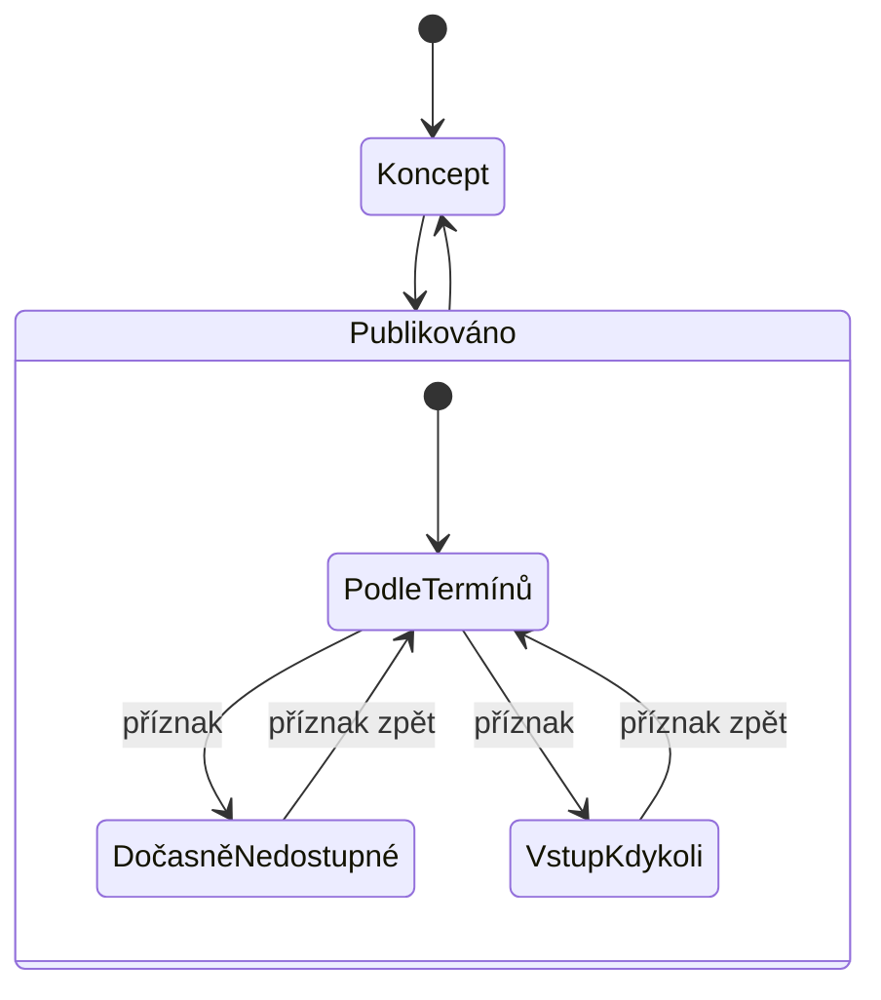

# Modul: Prohlídky

> Entity `tour`, `tourCategory`, `tourSlot`, `ticket`. Cesty `/admin/tours`,
> `/admin/tickets`, `/admin/tours/stats`. Sekce **Prohlídky**.
> Společné konvence jsou v [README.md](README.md) a tady se neopakují.
> **Revize:** nálezy `06/01`–`06/20`, rozhodnutí `00/01`, `00/02`, `00/07`–`00/13`.

## 1. Účel a role

- Komentované prohlídky a vstupy do areálu. Redakce popisuje **nabídku**; termíny,
  kapacitu a prodej drží **Colosseum**.
- Používá redaktor s oprávněním `tours`; podmodul Vstupenky navíc `tickets`.
- Modul má tři obrazovky: výpis prohlídek (se zanořenými kategoriemi), Vstupenky
  (prodané vstupenky z Colossea) a Statistiky (prodej).

**Prohlídka není akce.** Prohlídka je opakovaná placená služba s termíny z Colossea.
Akce je kurátorský program (modul 01).

## 2. Datový model a pole

### 2.1 Entita `tour` (prohlídka)

Kromě polí níže má entita společná pole podle [README](README.md#publikování).

#### Tab „Základní informace"

| Pole | name | Typ | Povinné | ML | Výchozí | Poznámka |
|---|---|---|---|---|---|---|
| Název prohlídky | `tour-title` | text | **ano** | ano | — | |
| URL adresa | `tour-url` | slug | **ano** | ano | z názvu | Unikátní v rámci jazyka |
| Kategorie | `tour-category_id` | ref → `tourCategory` | **ano** | ne | první kategorie | Skupina ve výpisu |
| Perex | `tour-perex` | textarea | ano, když zveřejněno | ano | — | Do výpisu a na kartu |
| Délka | `tour-duration` | text | ne | ne | — | Slovem, např. „100 minut" |
| Typ prohlídky | `tour-type` | enum | **ano** | ne | S průvodcem | Číselník 7.1, badge na kartě i filtr |
| Náročnost | `tour-difficulty` | enum | **ano** | ne | Schody / vyhlídka | Číselník 7.2, badge na kartě |
| Co vás při prohlídce čeká | `tour-highlights` | — | ne | ano | prázdné | Opakovatelné odrážky |
| Kdy prohlídky začínají | `tour-schedule` | textarea | ne | ano | — | Volný text nad termíny |
| Kontaktní e-mail | `tour-contact_email` | email | ne | ne | — | Web nezobrazuje — **O7** |
| Poznámka k platbě | `tour-payment` | text | ne | ano | — | Web nezobrazuje — **O7** |

#### Tab „Obsah"

| Pole | name | Typ | Povinné | ML | Výchozí | Poznámka |
|---|---|---|---|---|---|---|
| Obsah prohlídky | `tour-content` | blocks | ne | ano | prázdný | Content builder |

Omezení, doporučené vybavení a místo srazu **nejsou samostatná pole** — píšou se do bloků
obsahu *(rozhodnutí 00/07, nález 06/05)*. Důsledek: nedostanou se na kartu prohlídky,
jen do textu detailu.

#### Tab „Místo a Colosseum"

| Pole | name | Typ | Povinné | ML | Výchozí | Poznámka |
|---|---|---|---|---|---|---|
| Dočasně nedostupné | `tour-unavailable` | bool | **ano** | ne | ne | Zůstane ve výpisu, nejde koupit |
| Poznámka k nedostupnosti | `tour-unavailable_note` | text | ne | ano | — | Zobrazí se u karty |
| Bez termínů (vstup kdykoli) | `tour-undated` | bool | **ano** | ne | ne | Celodenní vstupy a balíčky |
| Platnost vstupenky | `tour-ticket_validity` | text | ano, když bez termínů | ne | — | Např. „30 dnů" |
| Místo konání | `tour-area_id` | refList → `venue` | ne | ne | prázdné | Prohlídka se nabídne u každého objektu |
| Napojení na Colosseum | `tour-colosseum_id` | text | ano, když zveřejněno | ne | — | Externí ID, unikátní |

#### Tab „Galerie"

| Pole | name | Typ | Povinné | ML | Výchozí | Poznámka |
|---|---|---|---|---|---|---|
| Připojené galerie | `tour-gallery_ids` | refList → `gallery` | ne | ne | prázdné | Web nezobrazuje — **O7** |
| Vlastní fotografie | `tour-photos` | gallery | ne | ne | prázdná | Hlavní fotka je náhledovka |

#### Pravý panel

| Pole | name | Typ | Povinné | ML | Výchozí | Poznámka |
|---|---|---|---|---|---|---|
| Štítky | `tour-tags` | tags | ne | ne | prázdné | Sada 7.3 — ruční, viz 6.3 |

### 2.2 Entita `tourCategory` (kategorie prohlídek)

| Pole | name | Typ | Povinné | ML | Výchozí | Poznámka |
|---|---|---|---|---|---|---|
| Název kategorie | `category-name` | text | **ano** | ano | — | Nadpis skupiny ve výpisu |
| Popis | `category-description` | richtext | ne | ano | — | Web nezobrazuje — ponecháno *(rozhodnutí 00/10)* |
| Fotogalerie | `category-photos` | gallery | ne | ne | prázdná | Web nezobrazuje — ponecháno |
| Připojené galerie | `category-gallery_ids` | refList → `gallery` | ne | ne | prázdné | Web nezobrazuje — ponecháno |

Nadřazený popisek nad nadpisem skupiny se **nedoplňuje** *(rozhodnutí 00/10, nález 06/09)* —
na rozdíl od stránek a bloků, kde pole „Menší nadpis" je (modul 04).

Sadu kategorií si určuje redakce; rozpor mezi třemi kategoriemi v adminu a šesti
skupinami na webu se neřeší jako nález administrace *(rozhodnutí 00/11, nález 06/12)*.

### 2.3 Entita `tourSlot` (termín) — jen pro čtení

| Pole | name | Typ | Poznámka |
|---|---|---|---|
| Datum a čas | — | datetime | Z Colossea |
| Kapacita | — | int | Z Colossea |
| Obsazeno | — | int | Z Colossea |

### 2.4 Entita `ticket` (vstupenka) — jen pro čtení

| Pole | name | Typ | Poznámka |
|---|---|---|---|
| Prohlídka | — | ref → `tour` | |
| Zákazník, e-mail | — | text, email | Z Colossea |
| Termín | — | datetime | Odpovídá `tourSlot` |
| Zakoupeno | — | datetime | |
| Typ vstupenky | — | text | Např. „Dospělí", „Rodinné vstupné" |
| Počet, částka | — | int, money | |

### 2.5 Pole, která modul vědomě nemá

| Co | Proč |
|---|---|
| Jazyky výkladu, místo srazu | Nedoplňuje se *(rozhodnutí 00/01, nálezy 06/03, 06/04)* |
| Ceny a cenové kategorie | Drží Colosseum; tabulka a popisky se skládají v content builderu *(rozhodnutí 00/02, nález 06/11)* — rozsah dat je **O6** |
| Nadpisy a texty kolem výpisu, blok „Praktické informace" | Natvrdo ve frontendu *(rozhodnutí 00/09, nálezy 06/08, 06/10)* |
| Nadřazený popisek kategorie | Nedoplňuje se *(rozhodnutí 00/10)* |

## 3. Stavy a životní cyklus

Publikační stav podle [README](README.md#publikování). Nad ním stojí **odvozená
dostupnost**, kterou web ukazuje na kartě.

| Dostupnost | Podmínka | Web |
|---|---|---|
| Dočasně nedostupné | `tour-unavailable` = ano | Karta zešedne, nejde koupit; zobrazí se poznámka |
| Vstup kdykoli | `tour-undated` = ano | Místo termínů platnost vstupenky, tlačítko „Koupit vstupenku" |
| Volná místa | Nejbližší termíny mají > 10 volných míst | Výběr termínu a nákup |
| Poslední místa | 1–10 volných míst | Totéž, zvýrazněné |
| Vyprodáno | 0 volných míst | Bez nákupu |
| Bez termínů | Žádný budoucí termín | Bez nákupu |

Ruční příznaky mají přednost před termíny z Colossea. Pořadí vyhodnocení je závazné:
nedostupné → bez termínů (kdykoli) → počty z Colossea.

Termíny ani vstupenky nemají v administraci stavy — jsou to projekce Colossea.

## 4. Obrazovky a UI

### 4.1 Seznam prohlídek (`/admin/tours`)

Stromový výpis: kategorie a pod nimi prohlídky.

- **Sloupce:** Kategorie / prohlídka (název, štítky) · Počet prohlídek v kategorii ·
  Dostupnost · Jazykové mutace · Akce.
- **Filtr:** kategorie · dostupnost · zveřejnění.
- **Řádkové akce:** Otevřít · Duplikovat · Smazat.
- **Přidání:** „Nová kategorie" a „Nová prohlídka".

### 4.2 Detail prohlídky (`/admin/tours/:id/edit`)

Záložky: Základní informace · Obsah · Místo a Colosseum · Galerie.
Pravý panel: publikace, štítky, zpětné vazby (kdo na prohlídku odkazuje).

### 4.3 Vstupenky (`/admin/tickets`)

Výpis prodaných vstupenek z Colossea, **jen pro čtení**.

- **Sloupce:** Zákazník · Prohlídka · Termín · Typ vstupenky · Počet · Částka · Zakoupeno.
- **Filtr:** prohlídka · období.

### 4.4 Statistiky (`/admin/tours/stats`)

Jediná analytická obrazovka systému. Zdrojem jsou vstupenky z Colossea.

| Výstup | Obsah |
|---|---|
| KPI dlaždice | Prodané vstupenky, tržba, průměrná cena, obsazenost — vždy s porovnáním proti minulému období |
| Vývoj prodeje | Časová řada, přepínač veličiny (kusy / tržba) |
| Žebříček prohlídek | Vodorovné pruhy, hodnota u pruhu |
| Podíl typů vstupenek | Výsečový graf, max. 6 částí, zbytek do „Ostatní" |
| Tabulka pod grafy | Tytéž hodnoty číselně — graf není jediná cesta k číslu |

Filtry (období první) jsou v jednom řádku nad grafy a platí pro vše pod nimi.

### 4.5 Dynamické chování formuláře

| Podmínka | Co se stane |
|---|---|
| Dočasně nedostupné = ano | Odkryje se poznámka k nedostupnosti |
| Bez termínů = ano | Odkryje se platnost vstupenky; seznam termínů z Colossea se označí jako nepoužitý |
| Napojení na Colosseum vyplněné a známé | Zobrazí se název okruhu a nejbližší termíny |
| Napojené ID Colosseum nezná | Prohlídka se hlásí jako naplánovaná — do zveřejnění v Colosseu nejde koupit |

## 5. Akce a workflow

- CRUD prohlídek i kategorií, duplikace, zveřejnění a stažení z webu.
- Napojení na Colosseum přes našeptávač načtených okruhů; ruční zadání ID je povolené.
- Vstupenky a termíny se needitují ani nemažou.

## 6. Byznys pravidla, výpočty a validace

### 6.1 Validace

| Pravidlo | Chování |
|---|---|
| Bez termínů = ano ⇒ platnost vstupenky vyplněná | Tvrdá při zveřejnění |
| Napojení na Colosseum vyplněné při zveřejnění | Tvrdá — bez ID nejde koupit vstupenku |
| Napojené ID Colosseum nezná | Měkká: uloží se, prohlídka se hlásí jako naplánovaná |
| Smazání kategorie s prohlídkami | Nelze; prohlídky se nejdřív přeřadí |

### 6.2 Dostupnost

Odvozená, neukládá se. Pravidla a pořadí viz 3.

### 6.3 Štítky

Web si štítky dřív **dopočítával z textu** (slovo „dět" v názvu, „zdarma" v ceně).
Nově je zadává redakce ručně *(rozhodnutí 00/12, nález 06/14)*. Typ a náročnost se
do štítků neduplikují — jsou to vlastní pole.

Filtry na webu se pojmenují podle toho, co skutečně filtrují: **skupina** (kategorie ve
výpisu) vs. **typ prohlídky** (badge na kartě) *(nález 06/13)*. Práce na straně webu.

## 7. Číselníky, notifikace, integrace

### 7.1 Typ prohlídky

| Kód | Popisek |
|---|---|
| `guided` | S průvodcem |
| `allday` | Celodenní |
| `experience` | Zážitkový program |
| `combined` | Kombinovaný |
| `camp` | Tábor & kroužek |

Uzavřený číselník — hodnoty odpovídají badgím na webu *(rozhodnutí 00/01, nález 06/01)*.

### 7.2 Náročnost

| Kód | Popisek |
|---|---|
| `stairs` | Schody / vyhlídka |
| `barrierFree` | Bezbariérové |

Bezbariérovost se řeší **u prohlídky**, ne u objektu *(nález 06/02)*.

### 7.3 Štítky
Předdefinované: `Pro děti` · `Zdarma`. Vlastní štítek smí redakce vytvořit.

### 7.4 Notifikace
Modul neposílá žádné.

### 7.5 Integrace — Colosseum

| Data | Směr | Perioda |
|---|---|---|
| Okruhy (časované i nečasované) | čtení | 1 h |
| Termíny, kapacita, volná místa | čtení | 1 h |
| Prodané vstupenky | čtení | 1 h |

Nákup i košík odbavuje Colosseum; web na něj odkazuje. Ceny jednotlivých typů vstupenek
API neposílá — rozsah dat je **O6**.

## 8. Vazby na jiné moduly

| Vazba | Vlastník | Pole | Když se prohlídka smaže |
|---|---|---|---|
| Prohlídka → objekt (místo konání) | **tento modul** | `tour-area_id` | Vazba zaniká, objekt zůstává |
| Prohlídka → kategorie | **tento modul** | `tour-category_id` | — |
| Akce → prohlídky | 01 Kalendář akcí | `event-tour_ids` | Akce ztrácí prodej vstupenek — nutné ošetřit hláškou |
| Novinka → prohlídky | 07 Aktuality | `news-tour_ids` | Vazba zaniká |
| Záložka objektu „automatický výpis prohlídek" | 02 Areál | odvozeno z `tour-area_id` | Prohlídka zmizí ze záložky |

**Nabízené prohlídky u objektu se needitují** — jediným zdrojem pravdy je `tour-area_id`.

## 9. Akceptační kritéria

| # | Kritérium |
|---|---|
| 06-1 | Prohlídka označená „dočasně nedostupné" zůstane ve výpisu na webu, karta zešedne a nejde koupit vstupenku. |
| 06-2 | Prohlídka „bez termínů" bez vyplněné platnosti vstupenky nejde zveřejnit. |
| 06-3 | Prohlídka „bez termínů" ukazuje na webu platnost vstupenky místo výběru termínu. |
| 06-4 | Typ prohlídky a náročnost se zobrazí jako badge na kartě i v detailu a dá se podle nich filtrovat. |
| 06-5 | Ručně přidaný štítek „Pro děti" se projeví ve filtru webu; prohlídka bez štítku se pod ním neobjeví, i když má „dět" v názvu. |
| 06-6 | Prohlídka bez napojení na Colosseum nejde zveřejnit; hláška to pojmenuje. |
| 06-7 | Prohlídka s ID, které Colosseum nezná, se uloží a hlásí se jako naplánovaná. |
| 06-8 | Kategorii s prohlídkami nejde smazat; hláška uvede, kolik prohlídek v ní je. |
| 06-9 | Výpadek Colossea nezablokuje editaci prohlídky; poslední známé termíny zůstanou zobrazené. |
| 06-10 | Statistiky ukazují u každé veličiny porovnání s minulým obdobím a tatáž čísla jsou i v tabulce pod grafy. |

## Otevřené otázky

| # | Otázka | Dopad |
|---|---|---|
| **O6** | Co všechno posílá Colosseum k cenám prohlídek (06/11)? | Nelze určit, co se zobrazí na webu a co se skládá v content builderu |
| **O7** | Přebytky u detailu (06/16–06/19) — odebrat richtext popis, připojené galerie, kontaktní e-mail a poznámku k platbě? | Model ponese pole bez využití; redakce je plní zbytečně |
