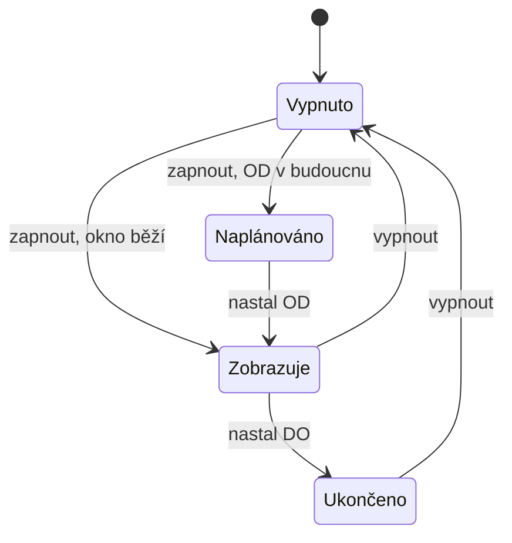

# Modul: Pop-up

> Entita `popup`. Cesta `/admin/popups`. Sekce **Obsah**.
> Společné konvence jsou v [README.md](README.md) a tady se neopakují.
> **Revize:** modul nebyl součástí revize.

## 1. Účel a role

- Vyskakovací okno na webu — upozornění na akci, změnu provozu, kampaň.
- Používá redaktor s oprávněním `popups`.
- Pop-upů může být připravených víc; zobrazuje se ten, který má aktivní časové okno.

## 2. Datový model a pole

Kromě polí níže má entita společná pole podle [README](README.md#publikování).

### Obsah okna

| Pole | name | Typ | Povinné | ML | Výchozí | Poznámka |
|---|---|---|---|---|---|---|
| Nadpis | `popup-title` | text | **ano** | ano | — | |
| Text | `popup-text` | richtext | ne | ano | — | |
| Obrázek | `popup-image` | image | ne | ne | — | |
| Cíl prokliku | `popup-title_url` | url | ne | ne | — | Kam okno vede po kliknutí |
| Otevřít v novém okně | `popup-new_window` | bool | **ano** | ne | ne | |

### Zobrazení

| Pole | name | Typ | Povinné | ML | Výchozí | Poznámka |
|---|---|---|---|---|---|---|
| Poloha na obrazovce | `popup-position` | enum | **ano** | ne | Uprostřed | Číselník 7.1 |
| Šířka okna | `popup-width` | int | **ano** | ne | 40 | Procenta šířky obrazovky; výška se dopočítá z obsahu |
| Rámeček okna | `popup-frame` | bool | **ano** | ne | ano | |
| Zobrazovat OD | `popup-from` | datetime | ne | ne | — | |
| Zobrazovat DO | `popup-to` | datetime | ne | ne | — | |
| Znovu nezobrazovat po zavření | `popup-cookie_expiration` | int | **ano** | ne | 7 | Počet dní; 0 = zobrazí se pokaždé |

## 3. Stavy a životní cyklus

Odvozený stav, který se neukládá:

| Stav | Podmínka |
|---|---|
| Zobrazuje se | Zapnutý a dnešek je uvnitř okna OD–DO |
| Naplánováno | Zapnutý a OD je v budoucnosti |
| Ukončeno | Zapnutý a DO už uplynulo |
| Vypnuto | Vypnutý |

## 4. Obrazovky a UI

### Seznam (`/admin/popups/list`)

- **Sloupce:** Náhled a nadpis · Poloha · Okno OD–DO · Stav · Jazykové mutace · Akce.
- **Filtr:** stav · jazyková mutace.

### Detail (`/admin/popups/:id/edit`)

Plátno s **živým náhledem** okna na maketě webu: redakce vidí polohu i šířku rovnou,
ne jako čísla. Vpravo nastavení obsahu a zobrazení.

## 5. Akce a workflow

CRUD pop-upů, duplikace, zapnutí a vypnutí.

## 6. Byznys pravidla, výpočty a validace

| Pravidlo | Chování |
|---|---|
| Zobrazovat DO ≥ Zobrazovat OD | Tvrdá, nelze uložit |
| Aktivních pop-upů ve stejném okně víc | Web zobrazí ten s nejnovějším OD; ostatní se v adminu hlásí jako překryté |
| Šířka okna | 20–90 % |

## 7. Číselníky, notifikace, integrace

### 7.1 Poloha na obrazovce

Devět poloh v mřížce 3×3, kódy `top-left` · `top-center` · `top-right` ·
`middle-left` · `center` · `middle-right` · `bottom-left` · `bottom-center` ·
`bottom-right`.

### 7.2 Notifikace
Modul neposílá žádné.

### 7.3 Integrace
Žádná.

## 8. Vazby na jiné moduly

Modul nemá vazby na jiné entity. Cíl prokliku je volná adresa, ne odkaz na entitu —
na rozdíl od Navigace a Patičky, kde se odkazuje na stránku nebo modul.

## 9. Akceptační kritéria

| # | Kritérium |
|---|---|
| 09-1 | Pop-up s oknem OD–DO se zobrazí jen uvnitř toho okna; mimo něj se na webu neobjeví. |
| 09-2 | Zavřený pop-up se návštěvníkovi znovu nezobrazí po nastavený počet dní. |
| 09-3 | Náhled v editoru odpovídá poloze a šířce, kterou návštěvník uvidí. |
| 09-4 | Jsou-li aktivní dva pop-upy naráz, administrace to hlásí a web zobrazí jen jeden. |

## Otevřené otázky

Modul nemá otevřené otázky.
