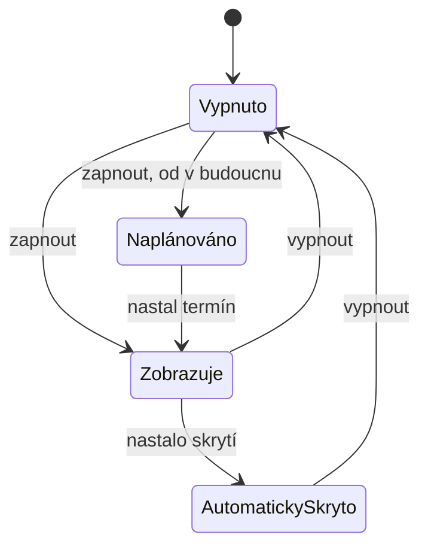

# Modul: Informační lišta

> Entita `infobar` (jeden záznam). Cesta `/admin/infobar`. Sekce **Obsah**.
> Společné konvence jsou v [README.md](README.md) a tady se neopakují.
> **Revize:** souvisí s nálezem `02/16` a rozhodnutím `00/20`; modul sám zadán mimo revizi.

## 1. Účel a role

- Úzký pruh nad hlavním menu webu pro provozní sdělení („Bolt Tower je dnes uzavřen").
- Používá redaktor s oprávněním `infobar`.
- **Jeden záznam**, ne výpis — web zobrazuje nejvýš jednu lištu.

## 2. Datový model a pole

| Pole | name | Typ | Povinné | ML | Výchozí | Poznámka |
|---|---|---|---|---|---|---|
| Text lišty | `infobar-text` | textarea | **ano** | ano | — | Krátké sdělení, jedna věta |
| Popisek odkazu | `infobar-link_label` | text | ne | ano | — | Prázdný = lišta je jen text |
| Adresa odkazu | `infobar-link_url` | url | ne | ne | — | Jedna adresa pro všechny mutace |
| Otevřít v novém okně | `infobar-new_window` | bool | **ano** | ne | ne | |
| Zobrazovat od | `infobar-show_from` | datetime | ne | ne | — | Naplánované zobrazení |
| Automatické skrytí | `infobar-hide_at` | datetime | ne | ne | — | Po termínu lišta zmizí |
| Zapnuto | `infobar-enabled` | bool | **ano** | ne | ne | |
| Jazykové mutace na webu | `infobar-published_langs` | langList | ne | ne | všechny vyplněné | |

**Adresa odkazu není vícejazyčná** — jedna pro všechny mutace, stejně jako u přidružených
odkazů stránky. Popisek vícejazyčný je.

## 3. Stavy a životní cyklus

Odvozený stav, který se neukládá:

| Stav | Podmínka | Web |
|---|---|---|
| Zobrazuje se | Zapnuto, dnešek uvnitř okna | Lišta je nad menu |
| Naplánováno | Zapnuto, „zobrazovat od" v budoucnosti | Lišta ještě není |
| Automaticky skryto | Zapnuto, „automatické skrytí" uplynulo | Lišta už není |
| Vypnuto | Vypnuto | Lišta není |

Lišta se v dané jazykové mutaci zobrazí, jen když má v ní **vyplněný text** a mutace je
zveřejněná. Prázdná mutace lištu nezobrazí.

## 4. Obrazovky a UI

Jedna obrazovka (`/admin/infobar`) bez výpisu.

Vlevo: **náhled** — pruh tak, jak sedí nad naznačeným menu webu, v právě prohlížené
mutaci. Když se lišta nezobrazí, náhled řekne proč (prázdný text / vypnuto / skrytá
mutace / uplynulý termín). Pod náhledem text a odkaz.

Vpravo: stav na webu, zapnutí, plánované zobrazení, automatické skrytí, viditelnost
po jazycích.

## 5. Akce a workflow

Úprava a uložení. Modul nic nezakládá ani nemaže.

## 6. Byznys pravidla, výpočty a validace

| Pravidlo | Chování |
|---|---|
| Automatické skrytí ≥ zobrazovat od | Tvrdá, nelze uložit |
| Popisek odkazu vyplněný, adresa prázdná | Odkaz se nezobrazí; lišta zůstane textem |
| Text prázdný v mutaci | Lišta se v té mutaci nezobrazí, i když je zapnutá |

## 7. Číselníky, notifikace, integrace

Modul nemá číselníky, neposílá notifikace a nemá integrace.

## 8. Vazby na jiné moduly

Modul nemá vazby na entity. **Vztah k poznámce k provozu u objektu (modul 02) je
otevřený — O11.**

## 9. Akceptační kritéria

| # | Kritérium |
|---|---|
| 10-1 | Lišta s vyplněným termínem automatického skrytí po něm z webu zmizí bez zásahu obsluhy. |
| 10-2 | Lišta se nezobrazí v mutaci, ve které nemá vyplněný text, ani když je zapnutá. |
| 10-3 | Náhled odpovídá tomu, co uvidí návštěvník; při skryté liště náhled uvede důvod. |
| 10-4 | Odkaz s příznakem „nové okno" se na webu otevře v novém okně. |

## Otevřené otázky

| # | Otázka | Dopad |
|---|---|---|
| **O11** | Propadá poznámka k provozu u objektu (02/16) do téže lišty automaticky? Co má přednost, když je vyplněné obojí? | Dvě místa plní tentýž pruh; bez rozhodnutí se implementuje jen jedno a druhé zůstane nezobrazené |
