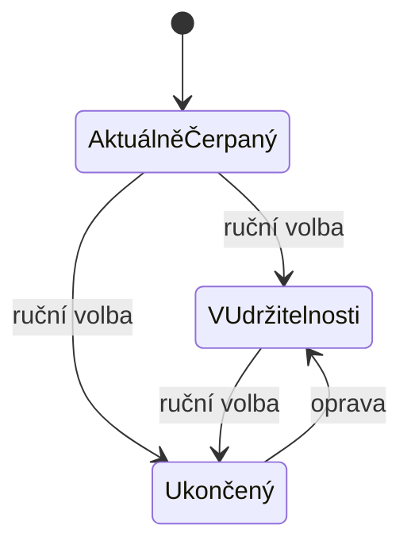

# Modul: Dotační projekty

> Entity `grantProject`, `grantProvider`. Cesty `/admin/grants`,
> `/admin/grants/providers`. Sekce **Dotační projekty**.
> Společné konvence jsou v [README.md](README.md) a tady se neopakují.
> **Revize:** modul nebyl součástí revize; zadán mimo ni podle živého webu.

## 1. Účel a role

- **Povinně zveřejňované údaje** o dotacích, ze kterých organizace čerpá. Na webu z nich
  vzniká výpis rozdělený podle fáze a seskupený podle poskytovatele.
- Používá redaktor s oprávněním `grants`.

Modul záměrně **nic nepřidává** nad rámec povinných údajů: projekt nemá vlastní adresu,
SEO ani obsah po blocích. U povinné publicity je přidaná hodnota na obtíž — každé pole
navíc je práce pro redakci bez dopadu na web.

**Úvodní text stránky se píše v modulu 04 Stránky** (stránka *Dotační projekty*
s content builderem). Tenhle modul dodává jen výpis, který se do ní vloží.

## 2. Datový model a pole

### 2.1 Entita `grantProvider` (poskytovatel dotace)

| Pole | name | Typ | Povinné | ML | Výchozí | Poznámka |
|---|---|---|---|---|---|---|
| Název poskytovatele | `provider-name` | text | **ano** | ne | — | Oficiální název programu nebo instituce |
| Logo | `provider-logo` | image | ne | ne | — | Povinná publicita, viz níže |
| Web poskytovatele | `provider-url` | url | ne | ne | — | Na výpisu se z loga stane odkaz |

**Logo patří poskytovateli, ne projektu.** Je to povinná publicita, která se opakuje
u všech jeho projektů — nahraje se jednou. Kdyby viselo na projektu, redakce ho nahrává
dvanáctkrát a při změně loga programu dvanáctkrát mění.

Název se **nepřekládá**: u povinné publicity musí zůstat v předepsané podobě.

### 2.2 Entita `grantProject` (projekt)

Kromě polí níže má entita společná pole podle [README](README.md#publikování).

| Pole | name | Typ | Povinné | ML | Výchozí | Poznámka |
|---|---|---|---|---|---|---|
| Název projektu | `grant-title` | text | **ano** | ano | — | Přesně podle rozhodnutí o dotaci |
| Poskytovatel | `grant-provider_id` | ref → `grantProvider` | **ano** | ne | první | Určuje skupinu i logo |
| Registrační číslo | `grant-reg_number` | text | **ano** | ne | — | Povinný údaj |
| Termín řešení od | `grant-from` | date | **ano** | ne | — | |
| Termín řešení do | `grant-to` | date | ne | ne | — | Prázdné = zatím neukončeno |
| Anotace | `grant-annotation` | textarea | ano, když zveřejněno | ano | — | Obsah a cíle projektu; web ji nezkracuje |
| Fáze | `grant-phase` | enum | **ano** | ne | Aktuálně čerpaný | Číselník 7.1 |

### 2.3 Pole, která modul vědomě nemá

| Co | Proč |
|---|---|
| URL adresa, SEO | Projekt nemá na webu vlastní stránku |
| Obsah po blocích | Web ukazuje jen anotaci |
| Přílohy | Zveřejnění dokumentů u dotací **není povinné** *(rozhodnutí 9. 9. 2026)*. Web u projektů žádné nemá |
| Částka dotace | Web ji neuvádí |
| Pořadí projektů | Řadí se podle poskytovatele a termínu, ručně se nemění |

## 3. Stavy a životní cyklus

Publikační stav podle [README](README.md#publikování). Nad ním stojí **fáze projektu**,
která určuje, pod kterou záložkou se projekt na webu objeví.

| Fáze | Kód | Web |
|---|---|---|
| Aktuálně čerpaný dotační titul | `active` | Záložka „Aktuálně čerpané dotační tituly" |
| Projekt v udržitelnosti | `sustainability` | Záložka „Projekty v udržitelnosti" |
| Ukončený projekt | `finished` | Záložka „Ukončené projekty" |

**Fáze se volí ručně, neodvozuje se z termínu.** Udržitelnost je právní stav po skončení
projektu a z termínu řešení nevyplývá — projekt může skončit a v udržitelnosti být ještě
pět let.

Administrace hlídá **rozpor**: projekt, kterému skončil termín řešení a zůstal mezi
aktuálně čerpanými, se ve výpisu i v detailu označí. Je to upozornění, ne blokace —
prodloužení termínu je běžná věc a přepnutí fáze musí zůstat na redakci.

## 4. Obrazovky a UI

### Seznam (`/admin/grants`)

Řazení jako na webu: podle poskytovatele, uvnitř od nejnovějšího termínu.

- **Sloupce:** Projekt (název, registrační číslo) · Poskytovatel · Termín řešení ·
  Fáze · Jazykové mutace · Akce.
- **Filtr:** fáze · poskytovatel.
- **Řádkové akce:** Otevřít · Smazat.
- **Tlačítka:** „Nový projekt" a „Poskytovatelé a loga".

### Detail projektu (`/admin/grants/:id/edit`)

Jedna sekce s údaji o projektu a pod ní **náhled záznamu tak, jak ho ukáže web** —
logo poskytovatele, název, termín, registrační číslo, anotace. Redakce vidí, že víc na
webu není.

Pravý panel: fáze (s upozorněním na rozpor s termínem), publikace.

### Poskytovatelé a loga (`/admin/grants/providers`)

Malý číselník s editací v řádku: logo, název, web, počet projektů. Jedno uložení pro
celý seznam.

## 5. Akce a workflow

CRUD projektů, přepnutí fáze, CRUD poskytovatelů, nahrání loga.

## 6. Byznys pravidla, výpočty a validace

| Pravidlo | Chování |
|---|---|
| Termín do ≥ termín od | Tvrdá, nelze uložit |
| Projekt bez registračního čísla nebo bez anotace | Nejde zveřejnit — je to povinný údaj |
| Poskytovatel bez loga | Uloží se; administrace to označí, web ukáže jen název |
| Smazání poskytovatele s projekty | **Nelze**; projekty se nejdřív přeřadí jinam |
| Prošlý termín u aktuálně čerpaného projektu | Měkké upozornění, nikdy blokace |

Mazání projektu má smysl **jen u překlepu**. Projekt, který skončil, patří mezi ukončené,
ne do koše — potvrzovací dialog to říká nahlas.

## 7. Číselníky, notifikace, integrace

### 7.1 Fáze projektu

| Kód | Popisek |
|---|---|
| `active` | Aktuálně čerpaný dotační titul |
| `sustainability` | Projekt v udržitelnosti |
| `finished` | Ukončený projekt |

### 7.2 Poskytovatelé
Zakládá redakce. Podle webu: Interreg V-A Česká republika – Polsko · Moravskoslezský kraj
· Statutární město Opava · Statutární město Ostrava.

### 7.3 Notifikace
Modul neposílá žádné.

### 7.4 Integrace
Žádná.

## 8. Vazby na jiné moduly

| Vazba | Vlastník | Pole | Když se poskytovatel smaže |
|---|---|---|---|
| Projekt → poskytovatel | **tento modul** | `grant-provider_id` | Nelze smazat, dokud má projekty |

Stránka *Dotační projekty* (modul 04) drží úvodní text; odkaz na ni je v patičce
(modul 12).

## 9. Akceptační kritéria

| # | Kritérium |
|---|---|
| 15-1 | Projekt bez registračního čísla nebo bez anotace nejde zveřejnit. |
| 15-2 | Projekt se na webu objeví pod záložkou podle své fáze a ve skupině svého poskytovatele. |
| 15-3 | Logo nahrané u poskytovatele se zobrazí u všech jeho projektů, aniž by se nahrávalo znovu. |
| 15-4 | Projekt s prošlým termínem, který zůstal mezi aktuálně čerpanými, se v administraci označí — a přesto ho lze uložit. |
| 15-5 | Poskytovatele, na kterého ukazují projekty, nejde smazat; hláška uvede jejich počet. |
| 15-6 | Náhled v detailu odpovídá tomu, co web u projektu zobrazí. |

## Otevřené otázky

Modul nemá otevřené otázky.

Zveřejnění dokumentů u dotací **není povinné** *(rozhodnutí 9. 9. 2026)*, proto projekt
nemá přílohy. Kdyby to někdy bylo potřeba, je doplnění příloh malý zásah do modelu —
soubory by se vkládaly k projektu, ne do textu stránky.
