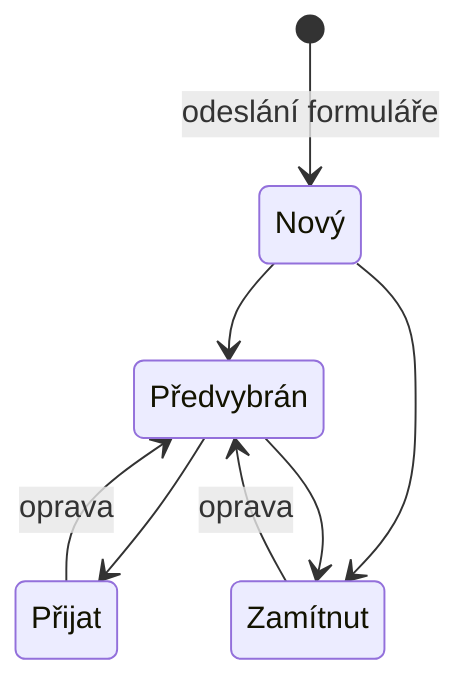

# Modul: Kariéra

> Entity `jobPosition`, `applicant`. Cesty `/admin/careers/positions`,
> `/admin/careers/applicants`. Sekce **Kariéra**.
> Společné konvence jsou v [README.md](README.md) a tady se neopakují.
> **Revize:** modul nebyl součástí revize; zadán mimo ni.

## 1. Účel a role

- Volné pozice na webu a přihlášky, které z nich přijdou. Dva pohledy na jeden tok:
  v **Pozicích** redakce popíše nabídku, z formuláře u pozice padají přihlášky
  do **Uchazečů**.
- Pozice používá redaktor s oprávněním `careers`; přihlášky tentýž.
- Modul pracuje s **osobními údaji uchazečů** — proto přísnější pravidla pro mazání,
  historii a souhlas (viz 3.3 a 6.3).

Dvě rozhodnutí, ze kterých vychází celý model:

1. **Přihláška je read-only záznam od návštěvníka.** Údaje přišly od uchazeče a v CMS se
   nepřepisují — jinak by se ztratilo, co člověk skutečně poslal. Mění se u ní jen stav,
   kdo ji řeší, a interní poznámka.
2. **Přihláška si drží název pozice v době odeslání.** Pozice se přejmenují nebo smažou,
   ale přihláška musí být čitelná i po roce.

## 2. Datový model a pole

### 2.1 Entita `jobPosition` (pozice)

Kromě polí níže má entita společná pole podle [README](README.md#publikování).

#### Tab „Základní informace"

| Pole | name | Typ | Povinné | ML | Výchozí | Poznámka |
|---|---|---|---|---|---|---|
| Název pozice | `position-title` | text | **ano** | ano | — | |
| URL adresa | `position-url` | slug | **ano** | ano | z názvu | Unikátní v rámci jazyka |
| Perex | `position-perex` | textarea | ano, když zveřejněno | ano | — | Do výpisu pozic |
| Úsek | `position-department` | enumOpen | **ano** | ne | Průvodcovské služby | Číselník 7.1, lze zadat vlastní |
| Typ úvazku | `position-employment` | enum | **ano** | ne | Hlavní pracovní poměr | Číselník 7.2 |
| Místo výkonu | `position-area_id` | ref → `venue` | ne | ne | — | Prázdné = celý areál / dohodou |
| Mzda od | `position-salary_from` | money | ne | ne | — | Číslo, ne text |
| Mzda do | `position-salary_to` | money | ne | ne | — | |
| Jednotka mzdy | `position-salary_unit` | enum | **ano** | ne | Kč / měsíc | Číselník 7.3 |
| Nástup možný od | `position-start_at` | date | ne | ne | — | Prázdné = na webu „dohodou" |

**Mzda je číslo, ne text** — je to nejazykový údaj a web podle něj řadí a filtruje.
Text „od 32 000 Kč" by se musel překládat a nešlo by podle něj řadit.

#### Tab „Popis pozice"

| Pole | name | Typ | Povinné | ML | Výchozí | Poznámka |
|---|---|---|---|---|---|---|
| Popis pozice | `position-content` | blocks | ne | ano | prázdný | Náplň práce, koho hledáme, co nabízíme |

#### Tab „Nábor"

| Pole | name | Typ | Povinné | ML | Výchozí | Poznámka |
|---|---|---|---|---|---|---|
| Přijímat přihlášky | `position-accepts` | bool | **ano** | ne | ano | Vypnuté = pozice zůstane, formulář ne |
| Uzávěrka přihlášek | `position-deadline` | date | ne | ne | — | Po ní web formulář nenabídne |
| Přihlášky řeší | `position-contact_user` | ref → `user` | **ano** | ne | přihlášený uživatel | Dostane nové přihlášky e-mailem |

### 2.2 Formulář zájmu na webu

Pole formuláře jsou **pevná**, redakce je nemění. Z nich žije modul Uchazeči — kdyby si
je redakce mohla přeskládat, rozpadly by se sloupce ve výpisu přihlášek.

| Pole formuláře | Povinné | Uloží se do |
|---|---|---|
| Jméno a příjmení | ano | `applicant-name` |
| E-mail | ano | `applicant-email` |
| Telefon | ne | `applicant-phone` |
| Proč se hlásíte | ne | `applicant-message` |
| Životopis | ano | příloha typu `cv` |
| Motivační dopis | ne | příloha typu `letter` |
| Souhlas se zpracováním údajů | ano | `applicant-consent_until` |

Souhlas je **pevnou součástí** formuláře; bez něj formulář neodešle.

### 2.3 Entita `applicant` (přihláška)

Vzniká odesláním formuláře. V CMS **jen pro čtení**, kromě polí označených *(editovatelné)*.

| Pole | name | Typ | Povinné | ML | Poznámka |
|---|---|---|---|---|---|
| Pozice | `applicant-position_id` | ref → `jobPosition` | ne | ne | Prázdné = obecná přihláška |
| Název pozice při odeslání | `applicant-position_title` | text | **ano** | ne | Drží se i po přejmenování nebo smazání pozice |
| Přišlo | `applicant-created_at` | datetime | **ano** | ne | |
| Jméno a příjmení | `applicant-name` | text | **ano** | ne | |
| E-mail | `applicant-email` | email | **ano** | ne | |
| Telefon | `applicant-phone` | phone | ne | ne | |
| Proč se hlásíte | `applicant-message` | textarea | ne | ne | Do náhledu ve výpisu |
| Odeslaná pole | `applicant-values` | — | **ano** | ne | Všechna pole v pořadí formuláře — zdroj pravdy pro detail |
| Přílohy | `applicant-files` | file[] | ne | ne | Typ `cv` / `letter` / `other` |
| Stav | `applicant-status` | enum | **ano** | ne | Číselník 7.4 *(editovatelné)* |
| Řeší | `applicant-assignee` | ref → `user` | ne | ne | Prázdné = nepřiřazeno *(editovatelné)* |
| Interní poznámka | `applicant-note` | textarea | ne | ne | Uchazeč ji nevidí *(editovatelné)* |
| Souhlas do | `applicant-consent_until` | date | **ano** | ne | Po vypršení se přihláška maže |

**Odeslaná pole se ukládají jako pořízený snímek** — popisek pole v době odeslání
a hodnota. Formulář se časem mění; přihláška si drží, na co člověk skutečně odpovídal.

## 3. Stavy a životní cyklus

### 3.1 Stav pozice

Odvozený, neukládá se.

| Stav | Podmínka | Web |
|---|---|---|
| Nabírá | Zveřejněno, přijímá přihlášky, uzávěrka neprošla | Pozice i formulář |
| Nábor uzavřen | Zveřejněno, ale přihlášky vypnuté nebo uzávěrka prošla | Pozice bez formuláře |
| Koncept | Nezveřejněno | Není na webu |

### 3.2 Stav přihlášky

| Z | Do | Kdo smí | Podmínka | Vedlejší efekt |
|---|---|---|---|---|
| — | Nový | návštěvník webu | Formulář odeslán se souhlasem | Přihláška vzniká, e-mail osobě u pozice |
| Nový | Předvybrán | editor modulu | — | — |
| Nový | Zamítnut | editor modulu | — | — |
| Předvybrán | Přijat | editor modulu | — | — |
| Předvybrán | Zamítnut | editor modulu | — | — |
| Zamítnut | Předvybrán | editor modulu | — | Oprava rozhodnutí |
| Přijat | Předvybrán | editor modulu | — | Oprava rozhodnutí |

Stav je **interní** — uchazeči se nikde nezobrazuje a nespouští mu žádný e-mail.
Odpovídá se ručně z e-mailového klienta.

### 3.3 Osobní údaje

| Pravidlo | Chování |
|---|---|
| Souhlas do | Povinný, vzniká z formuláře |
| Blížící se vypršení | Do 30 dnů se přihláška v detailu označí |
| Po vypršení | Denní úloha přihlášku označí; smazání je vědomý krok redakce |
| Smazání přihlášky | Maže i přílohy, nevratně — u osobních údajů je to správně |
| Historie | U přihlášky se zaznamenává změna stavu a přiřazení (kdo, kdy) — jediná entita s podrobnější historií |

## 4. Obrazovky a UI

### 4.1 Seznam pozic (`/admin/careers/positions`)

- **Sloupce:** Pozice (název, úsek, mzda) · Úvazek · Přihlášky (počet, z toho nových) ·
  Uzávěrka · Stav · Jazykové mutace · Akce.
- **Filtr:** stav · úsek.
- **Řádkové akce:** Otevřít · Zobrazit přihlášky · Smazat.

Počet přihlášek je odkaz do výpisu uchazečů filtrovaného na tu pozici. Pozice bez jediné
přihlášky po měsíci je signál, ne detail — proto je počet ve výpisu.

### 4.2 Detail pozice (`/admin/careers/positions/:id/edit`)

Záložky: Základní informace · Popis pozice · Nábor (s počtem přihlášek).
V záložce Nábor je přehled polí, která formulář sbírá, a pod ním **read-only výpis
přihlášek** na tuhle pozici.

### 4.3 Seznam uchazečů (`/admin/careers/applicants`)

- **Sloupce:** Uchazeč (jméno, e-mail) · Pozice · Přílohy (ikony podle typu) · Přišlo ·
  Stav · Řeší · Akce.
- **Filtr:** stav · pozice (včetně volby „obecné přihlášky").
- **Řádkové akce:** Otevřít · Odpovědět e-mailem · Předvybrat · Zamítnout · Smazat.
- **Hromadné akce:** Předvybrat · Zamítnout · Smazat.
- Nová přihláška je označená tečkou u jména.

### 4.4 Detail přihlášky (`/admin/careers/applicants/:id`)

Levý sloupec je **přesně to, co uchazeč odeslal** — odeslaná pole v pořadí formuláře
a přílohy ke stažení. Needituje se.

Pravý panel: stav (čtyři volby), kdo řeší, interní poznámka, souhlas do s upozorněním
na blížící se vypršení.

## 5. Akce a workflow

- CRUD pozic, duplikace, zveřejnění a stažení z webu.
- U přihlášky: změna stavu, přiřazení, poznámka, smazání.
- **Export přihlášek do CSV** — jediný export v systému; slouží k předání personalistovi.
- Odpověď uchazeči se píše ručně; tlačítko jen otevře poštovního klienta.

## 6. Byznys pravidla, výpočty a validace

### 6.1 Validace pozice

| Pravidlo | Chování |
|---|---|
| Mzda do ≥ mzda od | Tvrdá, nelze uložit |
| Pozice bez perexu | Nejde zveřejnit |
| Uzávěrka v minulosti | Uloží se; administrace hlásí, že formulář se nezobrazuje |

### 6.2 Přihláška

| Pravidlo | Chování |
|---|---|
| Formulář bez souhlasu | Neodešle se |
| Formulář bez životopisu | Neodešle se |
| Odeslaná pole a přílohy | V CMS needitovatelné, ani přes API |
| Smazání pozice | Přihlášky **zůstávají** i s názvem pozice |
| Obecná přihláška | Platný stav — uchazeč pošle životopis bez konkrétní pozice |

### 6.3 Ochrana údajů

Přihláška obsahuje osobní údaje včetně životopisu. Pravidla:

- Souhlas má vždy datum, do kdy platí.
- Po vypršení se přihláška označí; smazání je vědomý krok redakce, ne automat —
  automatické mazání by odstranilo i doklad o tom, jak se s přihláškou nakládalo.
- Smazání je nevratné a maže i přílohy. Dialog to říká výslovně.
- Export do CSV je akce, kterou smí provést jen editor modulu.

## 7. Číselníky, notifikace, integrace

### 7.1 Úsek

| Kód | Popisek |
|---|---|
| `guides` | Průvodcovské služby |
| `gastro` | Gastro |
| `operations` | Provoz a údržba |
| `education` | Vzdělávací programy |
| `marketing` | Marketing a PR |
| `admin` | Administrativa |

Otevřený číselník — vlastní úsek se ukládá jako text bez kódu.

### 7.2 Typ úvazku

| Kód | Popisek |
|---|---|
| `full` | Hlavní pracovní poměr |
| `part` | Zkrácený úvazek |
| `agreement` | DPP / DPČ |
| `internship` | Praxe a stáž |
| `seasonal` | Sezónní brigáda |

### 7.3 Jednotka mzdy
`month` — Kč / měsíc · `hour` — Kč / hodina

### 7.4 Stav přihlášky

| Kód | Popisek | Barva |
|---|---|---|
| `new` | Nový | značková |
| `shortlisted` | Předvybrán | jantarová |
| `hired` | Přijat | zelená |
| `rejected` | Zamítnut | neutrální šedá |

Zamítnutí má **neutrální barvu, ne červenou** — je to běžný konec náboru, ne chyba.

### 7.5 Notifikace

| Událost | Příjemce | Kanál | Šablona |
|---|---|---|---|
| Nová přihláška | Osoba uvedená u pozice | e-mail | `applicant-new` |

Uchazeči systém neposílá nic. Automatické odpovědi by potřebovaly modul šablon, který
v této dodávce není — **O2**.

### 7.6 Integrace
Žádná.

## 8. Vazby na jiné moduly

| Vazba | Vlastník | Pole | Když se cíl smaže |
|---|---|---|---|
| Pozice → objekt (místo výkonu) | **tento modul** | `position-area_id` | Objekt nelze smazat, dokud vazba trvá |
| Pozice → osoba, která řeší přihlášky | **tento modul** | `position-contact_user` | Uživatele nelze smazat, dokud je uvedený u pozice |
| Přihláška → pozice | vzniká z webu | `applicant-position_id` | **Přihláška zůstává**, drží název pozice |
| Přihláška → osoba, která ji řeší | **tento modul** | `applicant-assignee` | Přiřazení se zruší, přihláška zůstává |

Stránky *Kariéra* a *Volné pozice* (modul 04) drží úvodní texty; odkaz „Kariéra" je
v patičce (modul 12) a cíl „Kariéra — volné pozice" je k dispozici v Navigaci (modul 11).

## 9. Akceptační kritéria

| # | Kritérium |
|---|---|
| 16-1 | Odeslání formuláře bez souhlasu se zpracováním údajů neprojde. |
| 16-2 | Odeslaná přihláška se objeví v Uchazečích se stavem „Nový" a osobě uvedené u pozice přijde e-mail. |
| 16-3 | Odeslaná pole ani přílohy přihlášky nelze v CMS změnit — ani přes API. |
| 16-4 | Smazání pozice nesmaže přihlášky; v jejich výpisu zůstane název pozice tak, jak byl při odeslání. |
| 16-5 | Přejmenování pozice nezmění název pozice u dřívějších přihlášek. |
| 16-6 | Pozice s vypnutým příjmem přihlášek zůstane na webu a formulář se u ní nezobrazí. |
| 16-7 | Pozice s prošlou uzávěrkou nezobrazuje formulář, i když je příjem přihlášek zapnutý. |
| 16-8 | Přihláška se souhlasem, který vyprší do 30 dnů, se v detailu označí. |
| 16-9 | Smazání přihlášky smaže i její přílohy; dialog na to upozorní před potvrzením. |
| 16-10 | Životopis lze poslat i bez zvolené pozice — přihláška se uloží jako obecná. |
| 16-11 | Export přihlášek do CSV obsahuje odeslaná pole i stav a smí ho provést jen editor modulu. |

## Otevřené otázky

| # | Otázka | Dopad |
|---|---|---|
| **O2** | Kdo schvaluje text e-mailu o nové přihlášce a v jakých jazycích chodí? | Šablona vznikne narychlo a bez korektury |
