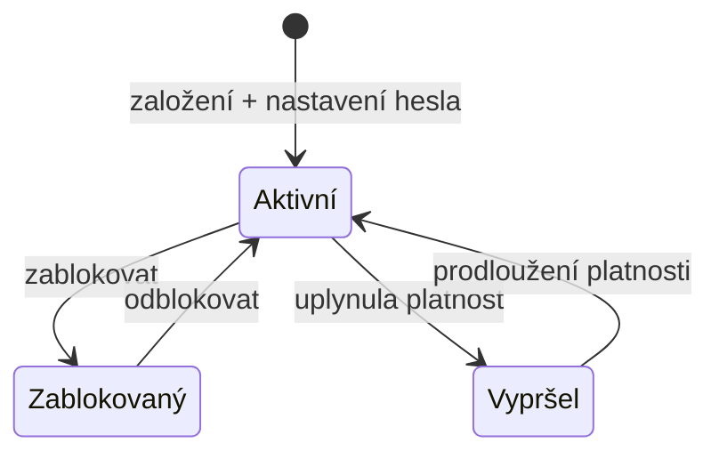

# Modul: Uživatelé

> Entita `user`. Cesta `/admin/users`. Sekce **Nastavení**.
> Společné konvence jsou v [README.md](README.md) a tady se neopakují.
> **Revize:** modul nebyl součástí revize; zadán mimo ni.

## 1. Účel a role

- Účty do administrace a jejich oprávnění. Zákaznické účty e-shopu to nejsou — ty jsou
  v Colosseu.
- Modul smí otevřít **jen `superadmin`**. Editor ho nevidí ani v menu.

**Účty a adresář lidí jsou jedna entita.** Uživatel je zároveň autor aktuality,
kontaktní osoba u pozice a řešitel přihlášky. Dva seznamy lidí by se rozešly.

## 2. Datový model a pole

### 2.1 Entita `user`

| Pole | name | Typ | Povinné | ML | Výchozí | Poznámka |
|---|---|---|---|---|---|---|
| Přihlašovací jméno | `user-login` | text | **ano** | ne | — | Unikátní, **neměnné** po založení |
| Jméno a příjmení | `user-name` | text | **ano** | ne | — | Pod tímhle jménem se podepisuje u záznamů |
| E-mail | `user-email` | email | **ano** | ne | — | Chodí sem odkaz na heslo a upozornění |
| Telefon | `user-phone` | phone | ne | ne | — | |
| Profilová fotka | `user-photo` | image | ne | ne | — | Bez fotky se zobrazí monogram |
| Přístup do administrace | `user-status` | enum | **ano** | ne | Aktivní | Číselník 7.1 |
| Oprávnění | `user-permissions` | — | **ano** | ne | prázdné | Viz 2.2 |
| Platnost účtu | `user-expires_at` | date | ne | ne | — | Po datu se uživatel nepřihlásí |
| Konec platnosti hesla | `user-password_expires_at` | date | ne | ne | — | Vynutí změnu hesla |
| Poslední přihlášení | `user-last_login` | datetime | ne | ne | — | **Jen pro čtení** |

**Jedno pole na jméno**, ne jméno + příjmení + celé jméno. Tři pole na totéž vedou
k nejasnosti, které se zobrazuje kde.

### 2.2 Oprávnění

Buď **správa všeho** (`all`), nebo součet per-modulových oprávnění. Seznam modulů
kopíruje strukturu menu:

| Skupina | Klíče |
|---|---|
| Přehled | `dashboard` |
| Program | `events`, `area`, `tours`, `tickets` |
| Obsah | `news`, `pages`, `galleries`, `faq`, `popups`, `infobar` |
| Struktura webu | `navigation`, `contacts`, `footer` |
| E-shop | `products`, `vouchers`, `product-categories` |
| Ostatní moduly | `education`, `grants`, `careers` |
| Nastavení | `taxonomy`, `users` |

Oprávnění je **per modul**, ne per pole ani per záznam. `all` nahrazuje jednotlivá
oprávnění a nekombinuje se s nimi.

### 2.3 Přihlašování a heslo

Do administrace se přihlašuje **vlastním účtem — přihlašovacím jménem a heslem**
*(rozhodnutí 9. 9. 2026)*. Federovaná identita (Google, Microsoft) se nezavádí.

**Heslo se ve formuláři nezadává.** Nový účet dostane e-mailem odkaz, kterým si uživatel
heslo nastaví sám; u existujícího účtu je tlačítko „Poslat odkaz na změnu hesla".
Pole na heslo v editačním formuláři je zvyk ze starých administrací, který nikomu
nepomáhá a svádí k posílání hesel e-mailem.

#### Uložení hesla

| Požadavek | Hodnota |
|---|---|
| Uložení | Hash s funkcí odolnou proti hádání (bcrypt / argon2), nikdy v otevřené podobě |
| Minimální délka | 10 znaků |
| Kontrola proti slovníku prozrazených hesel | ano, při nastavení i změně |
| Přenos | Jen přes HTTPS |
| Zobrazení v administraci | Nikdy — ani správci, ani v logu |

#### Reset hesla

Reset si vyžádá **uživatel sám** z přihlašovací obrazovky, nebo mu ho **pošle správce**
z detailu účtu. Oba případy vedou na stejný tok:

| Krok | Co se stane |
|---|---|
| 1 | Zadá se e-mail (uživatel), nebo se stiskne „Poslat odkaz na změnu hesla" (správce) |
| 2 | Vznikne jednorázový token s platností **60 minut** a odešle se e-mailem odkaz |
| 3 | Uživatel odkazem otevře formulář a zadá nové heslo dvakrát |
| 4 | Heslo se uloží, token se **znehodnotí**, ostatní nevyužité tokeny téhož účtu se zruší |
| 5 | Uživatel je přihlášen; ostatní jeho přihlášená sezení se ukončí |

| Pravidlo | Chování |
|---|---|
| Neexistující e-mail | Obrazovka odpoví stejně jako u existujícího — aby se nedalo zjistit, kdo účet má |
| Zablokovaný nebo vypršelý účet | Odkaz se neodešle; správci se to řekne, uživateli ne |
| Použitý nebo prošlý token | Odkaz nefunguje a nabídne vyžádat nový |
| Počet žádostí | Nejvýš 5 za hodinu na jeden účet a 20 za hodinu na jednu IP adresu |
| Token v e-mailu | Jednorázový, vázaný na účet, nejde použít pro jiný účet |

#### Vypršení hesla

Je-li u účtu vyplněný **konec platnosti hesla**:

| Kdy | Co se stane |
|---|---|
| 30 dnů před | Účet se ve výpisu i v detailu označí; uživateli přijde e-mail |
| Po datu | Uživatel se přihlásí, ale administrace ho pustí jen na formulář pro změnu hesla |
| Po změně | Konec platnosti se posune o stejný interval, jaký byl nastavený |

## 3. Stavy a životní cyklus

Stav účtu je z části uložený, z části odvozený.

| Stav | Odkud | Podmínka |
|---|---|---|
| Aktivní | uložený | Přístup povolen a platnost účtu neuplynula |
| Zablokovaný | uložený | Přístup zakázán |
| Vypršel | **odvozený** | Platnost účtu uplynula |

`Vypršel` se **neukládá** — uložený stav a datum platnosti vedle sebe jsou dva zdroje
pravdy, které si mohou odporovat.

## 4. Obrazovky a UI

### Seznam (`/admin/users`)

- **Sloupce:** Uživatel (fotka, jméno, login, e-mail) · Oprávnění (souhrn) · Stav ·
  Poslední přihlášení · Akce.
- **Filtr:** stav účtu · oprávnění (správa všeho / vybrané moduly / bez oprávnění).
- **Řádkové akce:** Otevřít účet · Poslat odkaz na změnu hesla · Zablokovat/odblokovat ·
  Přihlásit se jako · Smazat účet.
- **Hromadné akce:** Zablokovat · Odblokovat · Smazat.
- Vlastní účet je označený („to jste vy"), **nemá zaškrtávátko** a chybí u něj
  destruktivní akce.

### Detail (`/admin/users/:id/edit`)

Sekce **Účet** (fotka, jméno, login, e-mail, telefon, heslo) a **Oprávnění** (přepínač
správy všeho + moduly po skupinách; klik na název skupiny přepne celou skupinu).

Pravý panel: stav, platnost účtu, konec platnosti hesla, poslední přihlášení.

## 5. Akce a workflow

- CRUD účtů, blokování, odeslání odkazu na změnu hesla.
- **Přihlášení za uživatele** — správce uvidí administraci jeho očima, tedy jen moduly,
  na které má oprávnění. Zpět se vrátí odhlášením.
- Hromadné blokování a mazání.

## 6. Byznys pravidla, výpočty a validace

| Pravidlo | Chování |
|---|---|
| Přihlašovací jméno | Unikátní; po založení **neměnné**, i pro API |
| Účet bez jediného oprávnění | Uloží se; uživatel se přihlásí a neuvidí žádný modul |
| `all` a modulová oprávnění naráz | Nejde; `all` je nahrazuje |
| Smazat, zablokovat nebo se přihlásit za **vlastní účet** | **Nelze.** Akce nejsou v UI a API je odmítne |
| Smazání uživatele, který je autorem obsahu | Obsah zůstává; u záznamu zbyde jméno autora |
| Smazání uživatele uvedeného u pozice jako řešitele přihlášek | **Nelze**, dokud je u pozice uvedený |
| Heslo vyprší do 30 dnů | Ve výpisu i v detailu se to označí |

## 7. Číselníky, notifikace, integrace

### 7.1 Přístup do administrace

| Kód | Popisek |
|---|---|
| `active` | Aktivní |
| `blocked` | Zablokovaný |

### 7.2 Notifikace

| Událost | Příjemce | Kanál | Šablona |
|---|---|---|---|
| Odkaz pro nastavení hesla u nového účtu | Dotčený uživatel | e-mail | `user-password-setup` |
| Odkaz pro reset hesla | Dotčený uživatel | e-mail | `user-password-reset` |
| Heslo vyprší do 30 dnů | Dotčený uživatel | e-mail | `user-password-expiring` |

### 7.3 Integrace
Žádná. Přihlašování je vlastní — účet a heslo v tomto systému, bez napojení na externí
identity *(rozhodnutí 9. 9. 2026)*.

## 8. Vazby na jiné moduly

| Vazba | Vlastník | Pole | Když se uživatel smaže |
|---|---|---|---|
| Aktualita → autor | 07 Aktuality | `news-author` | Aktualita zůstává, zbyde jméno |
| Program → autor | 14 Vzdělávací programy | `program-author` | Program zůstává, zbyde jméno |
| Pozice → řeší přihlášky | 16 Kariéra | `position-contact_user` | **Nelze smazat**, dokud vazba trvá |
| Přihláška → řeší | 16 Kariéra | `applicant-assignee` | Přiřazení se zruší |
| Záznam → vytvořil / upravil | všechny moduly | `createdBy`, `updatedBy` | Záznam zůstává, zbyde jméno |

## 9. Akceptační kritéria

| # | Kritérium |
|---|---|
| 17-1 | Editor bez oprávnění `users` modul nevidí v menu a přímé volání jeho API vrací 403. |
| 17-2 | Uživatel nemůže smazat, zablokovat ani se přihlásit za vlastní účet; akce nejsou nabídnuté a API je odmítne. |
| 17-3 | Nový účet nemá ve formuláři pole na heslo; uživateli přijde e-mail s odkazem pro jeho nastavení. |
| 17-4 | Uživatel s oprávněním „správa všeho" vidí všechny moduly; zapnutím se jednotlivá oprávnění zneplatní. |
| 17-5 | Uživatel bez jediného oprávnění se přihlásí a neuvidí žádný modul. |
| 17-6 | Účet s uplynulou platností se hlásí jako vypršelý, aniž by se stav ukládal. |
| 17-7 | Přihlašovací jméno nejde po založení změnit, ani přes API. |
| 17-8 | Smazání autora nesmaže jeho aktuality; u záznamů zůstane jméno. |
| 17-9 | Uživatele uvedeného u pozice jako řešitele přihlášek nejde smazat; hláška uvede, u které pozice je. |
| 17-10 | Odkaz pro reset hesla přestane fungovat 60 minut po odeslání a po jednom použití. |
| 17-11 | Žádost o reset na neexistující e-mail odpoví stejně jako na existující — z odpovědi nejde zjistit, kdo účet má. |
| 17-12 | Nastavením nového hesla se ukončí ostatní přihlášená sezení téhož uživatele. |
| 17-13 | Uživatel s prošlým koncem platnosti hesla se přihlásí, ale dostane se jen na formulář pro změnu hesla. |
| 17-14 | Šesté vyžádání resetu během hodiny pro tentýž účet se odmítne. |
| 17-15 | Heslo není nikde v administraci ani v logu vidět v otevřené podobě. |

## Otevřené otázky

Modul nemá otevřené otázky. Přihlašování **vlastním účtem a heslem** včetně resetu je
rozhodnuté *(9. 9. 2026)* a rozepsané v sekci 2.3.
