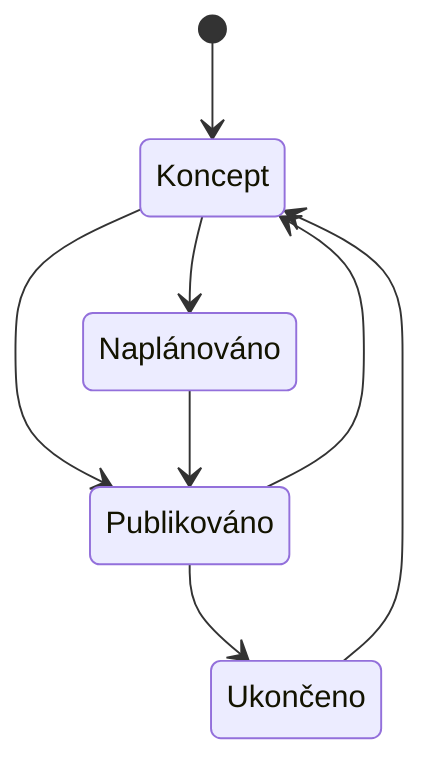
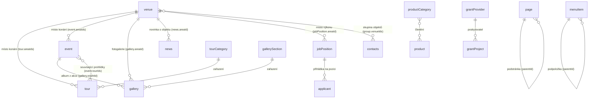

# Specifikace modulů administrace DOV

Podklad pro **vývoj** nové administrace webu <https://www.dolnivitkovice.cz>. Každý modul
má vlastní `.md` soubor podle jednotné osnovy. Rozhodnutí platná napříč systémem jsou
zde a v modulech se neopakují — moduly na ně odkazují.

**Zdroje:** běžící prototyp <https://dolnivitkovice-admin.vercel.app/> ·
[`docs/revize/nalezy.md`](../revize/nalezy.md) (94 nálezů revize prototypu proti webu) ·
[`docs/revize/rozhodnuti.md`](../revize/rozhodnuti.md) (49 rozhodnutí zadavatele) ·
[`docs/STANDARDY-MODULU.md`](../STANDARDY-MODULU.md) (konvence prototypu).

Sloupec **name** v tabulkách polí odpovídá field-tagu, který je v prototypu vidět
u každého pole — vývojář tak spáruje zadání s obrazovkou bez hádání.

**Dva zápisy téhož pole.** Mapa vazeb a diagramy v tomto dokumentu používají názvy polí
modelu (`event.areaIds`); tabulky v modulech field-tag z prototypu (`event-area_id`).
Jde o totéž pole — první zápis je pro čtení modelu, druhý pro spárování s obrazovkou.

## Zpracované moduly

| # | Modul | Soubor | Entita | Sekce v menu |
|---|---|---|---|---|
| 01 | Kalendář akcí | [01-kalendar-akci.md](01-kalendar-akci.md) | `event` | Kalendář akcí |
| 02 | Areál | [02-areal.md](02-areal.md) | `venue` | Areál |
| 03 | Galerie | [03-galerie.md](03-galerie.md) | `gallery`, `gallerySection` | Obsah |
| 04 | Stránky | [04-stranky.md](04-stranky.md) | `page` | Obsah |
| 05 | E-shop | [05-eshop.md](05-eshop.md) | `product`, `productCategory` | Produkty |
| 06 | Prohlídky | [06-prohlidky.md](06-prohlidky.md) | `tour`, `tourCategory`, `tourSlot`, `ticket` | Prohlídky |
| 07 | Aktuality | [07-aktuality.md](07-aktuality.md) | `news` | Obsah |
| 08 | FAQ | [08-faq.md](08-faq.md) | `faq` | Obsah |
| 09 | Pop-up | [09-popup.md](09-popup.md) | `popup` | Obsah |
| 10 | Informační lišta | [10-informacni-lista.md](10-informacni-lista.md) | `infobar` | Obsah |
| 11 | Navigace | [11-navigace.md](11-navigace.md) | `menu`, `menuItem` | Obsah |
| 12 | Patička | [12-paticka.md](12-paticka.md) | `footer` | Obsah |
| 13 | Kontakty | [13-kontakty.md](13-kontakty.md) | `contacts` | Obsah |
| 14 | Vzdělávací programy | [14-vzdelavaci-programy.md](14-vzdelavaci-programy.md) | `program` | Vzdělávací programy |
| 15 | Dotační projekty | [15-dotacni-projekty.md](15-dotacni-projekty.md) | `grantProject`, `grantProvider` | Dotační projekty |
| 16 | Kariéra | [16-kariera.md](16-kariera.md) | `jobPosition`, `applicant` | Kariéra |
| 17 | Uživatelé | [17-uzivatele.md](17-uzivatele.md) | `user` | Nastavení |
| 18 | Štítky a kategorie | [18-stitky-a-kategorie.md](18-stitky-a-kategorie.md) | `taxonomyTerm` | Nastavení |
| 19 | Dashboard | [19-dashboard.md](19-dashboard.md) | — | (úvod) |

Čísla modulů odpovídají číslování sekcí v revizi: nálezy `01/xx` patří k modulu 01,
`02/xx` k modulu 02 a tak dál až po `06/xx`.

**Mimo rozsah dodávky:** frontend webu, prodejní systém Colosseum, objednávkový systém
Francesca, interní DOVIS, e-mailing Ecomail. Zmíněny jen jako vazby.

---

## Společné konvence (platí napříč moduly)

### Vícejazyčnost

Jazyky: **čeština (zdrojová), angličtina, němčina, polština**. Sloupec **ML** v tabulkách
polí říká, jestli je pole vícejazyčné.

- Vícejazyčné je to, co je text pro čtení na webu: název, perex, popis, popisek odkazu.
- Vícejazyčné není: datum, čas, cena, číslo, ID, e-mail, telefon, URL, obrázek, barva,
  vazba na jiný záznam.
- **Vlastní jména se nepřekládají** — název organizace, poskytovatele dotace, programu.
- Prázdná mutace se na webu nezobrazí; návštěvník uvidí českou verzi.

### Publikování

Dvě nezávislé roviny:

| Rovina | Co řídí | Pole |
|---|---|---|
| Stav záznamu | **kdy** je záznam živý | `published`, `publishFrom`, `publishTo` |
| Publikace mutací | **které** jazykové mutace se zobrazí | `publishedLangs` |

Prázdnou mutaci nelze zveřejnit. `publishedLangs` nevyplněné = všechny vyplněné mutace
jsou živé.

Stavový model společný obsahovým modulům:

| Z | Do | Kdo smí | Podmínka | Vedlejší efekt |
|---|---|---|---|---|
| — | Koncept | editor modulu | — | Záznam vzniká jako koncept |
| Koncept | Publikováno | editor modulu | Povinná pole a česká mutace vyplněné | Záznam je na webu |
| Koncept | Naplánováno | editor modulu | `publishFrom` v budoucnosti | Zveřejní se automaticky |
| Naplánováno | Publikováno | plánovaná úloha | Nastal `publishFrom` | Záznam je na webu |
| Publikováno | Koncept | editor modulu | — | Záznam z webu mizí |
| Publikováno | Ukončeno | plánovaná úloha | Nastal `publishTo` | Záznam z webu mizí, v adminu zůstává |

Modul s vlastním stavovým modelem (06 Prohlídky, 15 Dotační projekty, 16 Kariéra) ho
popisuje u sebe; tenhle pak platí jen pro publikaci.

### Vlastník vazby

Každá vazba má **jednoho vlastníka** — modul, v jehož detailu se nastavuje. Druhá strana
ji jen zrcadlí read-only. Vazba se nikdy needituje na obou stranách. Zpětné vazby
(„kde se na tento záznam odkazuje") se neukládají, dopočítávají se.

### Obsah po blocích

Dlouhý obsah stránek, budov, akcí, prohlídek a produktů se skládá z **bloků obsahu**
(content builder), ne z pevných polí. Entita má jen pole, která web potřebuje
strukturovaně — do výpisu, na kartu, do filtru. Blok je `{ id, kind, text?, eyebrow? }`;
katalog typů bloků dodá frontend — **otevřená otázka O1**.

### SEO

Titulek a popisek pro vyhledávače a sdílení se **odvozují z názvu a perexu** a v
administraci se nepřepisují. Obrázek pro sdílení se bere z hlavní fotky záznamu. Žádná
entita nemá pole `metaTitle`, `metaDescription`, `metaKeywords`, `ogImage`,
`canonicalUrl`. Indexování se v administraci neřídí. *(rozhodnutí 00/24)*

### Texty kolem výpisů

Nadpisy, úvodní texty a rozcestníky nad a pod výpisy jsou natvrdo ve frontendu.
Administrace pro ně nemá pole. *(rozhodnutí 00/09, 00/25, 00/33, 00/39)*

### Štítky

Průřezová kategorizace nezávislá na jazyce, pole `tags`. Každý modul má **vlastní sadu**
předdefinovaných štítků; společný číselník napříč moduly se nezavádí. Štítek se
referencuje českým názvem, překlady a barvy drží modul 18.

### Řazení

Řeší se **per modul**. Kde je pořadí uživatelské, mění se přetažením a ukládá do pole
`order` (celé číslo, přečísluje se od 1 mezi sourozenci). Kde uživatelské není, řadí web
podle data.

### Mazání

Výchozí je **hard delete** s potvrzovacím dialogem, který pojmenuje důsledky. Kaskády
jsou vždy explicitní — každý modul u své vazby uvádí, co se stane s protistranou.

### Historie změn

U všech entit `createdAt`, `createdBy`, `updatedAt`, `updatedBy` — jen pro čtení včetně
API. Plný audit log po polích se neřeší; výjimkou jsou přihlášky uchazečů (modul 16),
kde je potřeba doložit nakládání s osobními údaji.

### Přihlašování

Do administrace se přihlašuje **vlastním účtem — přihlašovacím jménem a heslem**
*(rozhodnutí 9. 9. 2026)*. Federovaná identita se nezavádí. Heslo se ukládá jako hash,
nikdy v otevřené podobě, a v administraci se nikde nezobrazuje. Reset hesla si vyžádá
uživatel sám z přihlašovací obrazovky, nebo mu ho pošle správce; tok, platnost odkazu
a limity jsou v modulu [17 Uživatelé](17-uzivatele.md).

### Čas a prostředí

Jedno časové pásmo **Europe/Prague**; datum s časem se ukládá jako lokální čas, ne UTC.
Tři prostředí: produkce, příprava, lokální vývoj. Obsah se mezi nimi nepromuje —
redakce pracuje přímo na produkci; promují se jen změny kódu a schématu.

### Validace

Pravidla se vynucují **na serveru** — formulářová kontrola je pohodlí, ne bezpečnost;
API i import kontrolují totéž. Povinnost se ověřuje při uložení, ne při psaní: rozepsaný
záznam jde uložit jako koncept i neúplný, zveřejnit ne. Podmíněná povinnost se zapisuje
slovem „povinné, když …". Chybová hláška říká, co je špatně a co s tím.

### Obrazovky

Obsahový modul má **výpis** a **detail**; konfigurační modul (10, 12, 13) má jednu
obrazovku bez výpisu, protože záznam je jeden.

- **Výpis:** hlavička (identifikátor entity, nadpis, tlačítko „Nový…"), filtrační pruh,
  tabulka, prázdný stav. **Bez fulltextu** — hledání pokrývá globální vyhledávání v horní
  liště.
- **Detail:** dvousloupcové rozvržení, obsahové sekce v záložkách vlevo, publikace a
  metadata vpravo. Přepínač jazykových mutací je v hlavičce a přepíná napříč sekcemi.
- **Akce:** Uložit · Uložit a zpět · Duplikovat · Smazat. Mazání vždy přes potvrzení.

---

## Katalog datových typů

Uzavřený. Nový typ se nejdřív přidá sem i s pravidly, teprve pak se použije.

| Typ | Pravidla |
|---|---|
| `text` | Jednořádkový text, max. 255 znaků, ořezané okrajové mezery |
| `textarea` | Víceřádkový text, max. 2 000 znaků |
| `richtext` | Formátovaný text (odstavce, tučné, odkazy, seznamy) |
| `slug` | Malá písmena, číslice, pomlčky; unikátní v rámci entity a jazyka; generuje se z názvu, ručně přepsatelný |
| `int` | Celé číslo, rozsah uvádí pole |
| `money` | Částka v Kč, celé koruny |
| `bool` | Ano/ne, výchozí hodnotu uvádí pole |
| `date` | `YYYY-MM-DD` |
| `datetime` | `YYYY-MM-DDTHH:mm`, pásmo Europe/Prague |
| `time` | `HH:mm` |
| `enum` | Výběr z uzavřeného číselníku s kódy |
| `enumOpen` | Číselník + volný text; ukládá se hodnota, ne kód |
| `ref` | Vazba na jeden záznam (ID), prázdné = bez vazby |
| `refList` | Vazba na víc záznamů, pořadí významné |
| `tags` | Pole českých názvů štítků |
| `image` | JPG/PNG/WEBP, max. 8 MB |
| `file` | PDF/DOC/DOCX/XLS/XLSX, max. 20 MB |
| `gallery` | Pole `{ id, src, alt, isMain }`, právě jeden `isMain` |
| `blocks` | Obsah po blocích |
| `url` | Absolutní adresa, `https://` |
| `email` | Validace formátu |
| `phone` | Volný text, doporučený tvar `+420 xxx xxx xxx` |
| `color` | Hex `#rrggbb` |
| `langList` | Podmnožina `['cs','en','de','pl']` |

Vícejazyčnost není typ — je to sloupec **ML** v tabulce polí. Pole s `ML = ano` nese
hodnotu pro každý jazyk zvlášť.

---

## Vzájemné vazby modulů

| Vazba | Vlastník (edituje se zde) | Zrcadlí se | Pole | Když se smaže vlastník |
|---|---|---|---|---|
| Akce → objekt | 01 Kalendář akcí | 02 Areál | `event.areaIds` | vazba zaniká |
| Akce → prohlídky | 01 Kalendář akcí | 06 Prohlídky | `event.tourIds` | vazba zaniká |
| Novinka → objekt | 07 Aktuality | 02 Areál | `news.areaId` | vazba zaniká |
| Prohlídka → objekt | 06 Prohlídky | 02 Areál | `tour.areaIds` | vazba zaniká |
| Album → objekt | 03 Galerie | 02 Areál | `gallery.areaId` | vazba zaniká |
| Album → akce | 03 Galerie | 01 Kalendář akcí | `gallery.eventId` | vazba zaniká |
| Pozice → objekt | 16 Kariéra | 02 Areál | `jobPosition.areaId` | vazba zaniká |
| Přihláška → pozice | vzniká z webu | 16 Kariéra | `applicant.positionId` | **přihláška zůstává**, drží název pozice |
| Projekt → poskytovatel | 15 Dotační projekty | — | `grantProject.providerId` | poskytovatele s projekty nelze smazat |
| Odkaz → stránka / modul | 11 Navigace, 12 Patička | — | `navItem.target` | odkaz zůstane bez cíle a hlásí se jako neúplný |

**Nabízené prohlídky, akce, novinky a galerie u objektu se needitují** — jsou odvozené
z vazeb, které vlastní protějšek.

---

## Oprávnění

Oprávnění je **per modul**, ne per entita a ne per pole. Uživatel s oprávněním na modul
v něm smí číst, zakládat, upravovat i mazat. Kdo oprávnění nemá, modul nevidí ani v menu
a jeho API endpointy mu vrací 403.

| Role | Rozsah |
|---|---|
| `superadmin` | Všechny moduly včetně 17 Uživatelé a 18 Štítky a kategorie |
| `editor` | Jen moduly, na které má oprávnění |
| `anonym` | Čte zveřejněný obsah přes veřejné API |

Role nejsou hierarchie: `editor` je součet modulových oprávnění, `superadmin` je zkratka
pro „všechny moduly". Dělení podle oddělení ani vlastníka záznamu se nezavádí — redakce
je jeden tým a všichni s oprávněním na modul vidí všechny jeho záznamy.

| Entita | superadmin | editor modulu | anonym |
|---|---|---|---|
| Obsahové entity modulů 01–16 | C R U D | C R U D | R (jen zveřejněné) |
| `user` (17) | C R U D | — | — |
| `taxonomyTerm` (18) | C R U D | C R U D | R |
| `applicant` (16) | R U D | R U D | C (odesláním formuláře) |
| `tourSlot`, `ticket` (06) | R | R | R |
| `product` — pole z Colossea (05) | R | R | R |

Prázdná buňka znamená **zákaz**. Nad rámec modulového oprávnění platí:

| Pravidlo | Důvod |
|---|---|
| Nikdo nesmí smazat ani zablokovat vlastní účet | Chyba obsluhy, ne záměr |
| Přihlášku uchazeče nelze upravovat, jen měnit stav, přiřazení a poznámku | Je to text od návštěvníka |
| Termíny prohlídek, vstupenky a údaje produktu z Colossea jsou jen pro čtení | Zdrojem pravdy je Colosseum |

---

## Integrace

### Colosseum — import, jen čtení

Nákup, košík i vouchery odbavuje Colosseum. Párování přes externí ID `colosseumId`;
záznam s ID, které Colosseum nezná, zůstává v adminu a hlásí se jako nenapojený.
Ceny jednotlivých typů vstupenek API neposílá.

| Data | Kam | Perioda |
|---|---|---|
| Okruhy, termíny, kapacita, volná místa | 06 Prohlídky | každou hodinu |
| Zboží a vouchery (ID, název, cena, sklad) | 05 E-shop | každou hodinu |
| Tábory a jejich termíny | 01 Kalendář akcí | každou hodinu |
| Objekty s naplánovanými prohlídkami | 02 Areál | každou hodinu |

Výpadek Colossea nesmí zablokovat editaci ostatních polí — zůstanou poslední známé údaje
a dashboard hlásí stáří dat.

### Francesca — odkaz ven

Bez integrace. U vzdělávacího programu je ruční pole `reservationUrl`, prostý odkaz.

### DOVIS

Neřešíme. Zůstává zachovaná subdoména `dovis.dolnivitkovice.cz`, žádná data neproudí.

### Veřejné API

Frontend čte obsah přes REST API: vrací se jen zveřejněné záznamy a jen zveřejněné
mutace, jazyk se předává parametrem, chybějící mutace se stahuje na češtinu, výchozí
stránka je 24 záznamů. Čtení bez autentizace, zápis jen z administrace. Přesný tvar
endpointů dodá implementace — **otevřená otázka O4**.

### Plánované úlohy

| Úloha | Perioda | Při chybě |
|---|---|---|
| Publikace naplánovaných záznamů | 5 min | Zaloguje, opakuje v dalším běhu |
| Ukončení zobrazení podle `publishTo` | 5 min | Totéž |
| Import z Colossea | 1 h | Ponechá poslední známý stav, upozorní na dashboardu |
| Kontrola souhlasů uchazečů | denně | Zaloguje |

### Notifikace

| Událost | Příjemce | Kanál |
|---|---|---|
| Nová přihláška na pozici | Osoba uvedená u pozice | e-mail |
| Odkaz pro nastavení hesla u nového účtu | Dotčený uživatel | e-mail |
| Odkaz pro reset hesla | Dotčený uživatel | e-mail |
| Heslo vyprší do 30 dnů | Dotčený uživatel | e-mail |
| Selhal import z Colossea | Uživatelé s oprávněním na 05 nebo 06 | dashboard |

Jiné notifikace systém neposílá. Odpovědi uchazečům píše redakce ručně.
Texty šablon schvaluje zadavatel — **otevřená otázka O2**.

---

## Nefunkční požadavky

| Požadavek | Hodnota |
|---|---|
| Akcí ročně | do 400 |
| Prohlídek | do 60 |
| Produktů | do 300 |
| Fotek v galerii | do 20 000 celkem, do 300 v albu |
| Přihlášek uchazečů ročně | do 500 |
| Souběžných uživatelů administrace | do 10 |
| Odezva výpisu | do 1,5 s pro 95 % dotazů |
| Odezva veřejného API | do 500 ms pro 95 % dotazů |
| Obrázek | max. 8 MB, automatické zmenšení nad 2 500 px |
| Příloha | max. 20 MB |
| Prohlížeče | poslední dvě verze Chrome, Safari, Firefox, Edge |
| Administrace na mobilu | čitelná, needitační; cílem je desktop |

Migrace obsahu ze stávajícího webu je samostatná dodávka mimo tento rozsah —
**otevřená otázka O3**.

---

## Akceptační kritéria — společná

Ověřitelná bez přítomnosti autora zadání. Kritéria jednotlivých modulů jsou u nich.

| # | Kritérium |
|---|---|
| A1 | Redaktor bez oprávnění na modul ho nevidí v menu a přímé volání jeho API vrací 403. |
| A2 | Záznam s prázdnou českou mutací nelze zveřejnit; hláška pojmenuje chybějící pole. |
| A3 | Záznam zveřejněný jen v češtině se na anglické verzi webu zobrazí česky, ne prázdný. |
| A4 | Naplánovaný záznam se zveřejní do 5 minut po nastaveném čase bez zásahu obsluhy. |
| A5 | Výpadek Colossea nezablokuje editaci; poslední známé údaje zůstanou zobrazené a dashboard hlásí stáří dat. |
| A6 | Smazání záznamu, na který jiný záznam odkazuje, se chová podle tabulky vazeb — ověřuje se u každé vazby zvlášť. |
| A7 | Uživatel nemůže smazat ani zablokovat vlastní účet; akce nejsou v UI nabídnuté a API je odmítne. |

---

## Otevřené otázky

Otázky, které se týkají jednoho modulu, jsou u něj; tady jsou průřezové. Každá má dopad,
kdo rozhoduje a do kdy — bez dopadu se nález v připomínkovém řízení smete ze stolu.

| # | Otázka | Dopad, když se nerozhodne | Rozhodne | Termín |
|---|---|---|---|---|
| O1 | Jaký je katalog bloků obsahu a co která šablona umí? | Nejde odhadnout práci na frontendu ani na editoru; redakce neví, co si může poskládat | Zadavatel + dodavatel frontendu | před zahájením modulu 04 |
| O2 | Kdo schvaluje texty systémových e-mailů a v jakých jazycích chodí? | Šablony vzniknou narychlo a bez korektury | Zadavatel | před nasazením modulu 16 |
| O3 | Co všechno se migruje ze stávajícího webu a kdo migraci dodá? | Migrace bývá půlka rozpočtu; bez rozsahu nelze cenit | Zadavatel + dodavatel | před podpisem harmonogramu |
| O4 | Kdo dodá frontend a v jakém tvaru očekává API? | Tvar API se navrhne naslepo a bude se předělávat | Zadavatel | před zahájením implementace |
| O5 | Pět polí u akce, která web nezobrazuje (nálezy 01/10–01/13) — doplnit na web, nebo z modelu odebrat? | Redakce plní pole, která nikam nejdou | Zadavatel | před zahájením modulu 01 |
| O6 | Co všechno posílá Colosseum k cenám prohlídek (nález 06/11)? | Nelze určit, co se zobrazí na webu a co se zadává v CMS | Zadavatel + Colosseum | před zahájením modulu 06 |
| O7 | Přebytky u detailu prohlídky (nálezy 06/16–06/19) — odebrat richtext popis, galerii, kontaktní e-mail a poznámku k platbě? | Model ponese pole bez využití | Zadavatel | před zahájením modulu 06 |
| O8 | Zvýrazněná akce ve výpisu (nález 01/08) — zavést příznak? | Redakce nemůže vypíchnout akci | Zadavatel | před zahájením modulu 01 |
| O9 | Uzavřený seznam objektů areálu (nálezy 02/12, 01/19, 04/12) | Web pracuje s objekty, které administrace nezná | Zadavatel | při plnění dat |
| O10 | Přebírá kalendář termíny prohlídek automaticky (nález 01/18)? | Nejasný zdroj dat pro kalendář, riziko dvojího zadávání | Zadavatel | před zahájením modulu 01 |
| O11 | Propadá poznámka k provozu u budovy do informační lišty automaticky, nebo se ukazuje jen na stránce budovy? | Dvě místa plní tentýž pruh a není jasné, co má přednost | Zadavatel | před zahájením modulu 10 |

### Uzavřené otázky

| # | Otázka | Rozhodnutí | Kdy |
|---|---|---|---|
| O12 | Má se vzdělávací program vázat na objekt v Areálu? | **Ne.** Web programy podle místa nefiltruje a u objektu se nezobrazují — počítá se s tím (modul 14, sekce 8) | 9. 9. 2026 |
| O13 | Je u dotací povinné zveřejnit i dokumenty? | **Není povinné.** Projekt proto nemá přílohy (modul 15, sekce 2.3) | 9. 9. 2026 |
| O14 | Vlastní účet, nebo firemní identita? | **Vlastní účet a heslo**, včetně resetu hesla — rozepsáno v modulu 17, sekce 2.3 | 9. 9. 2026 |
